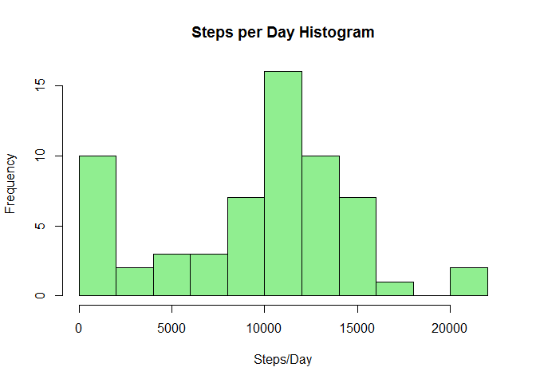
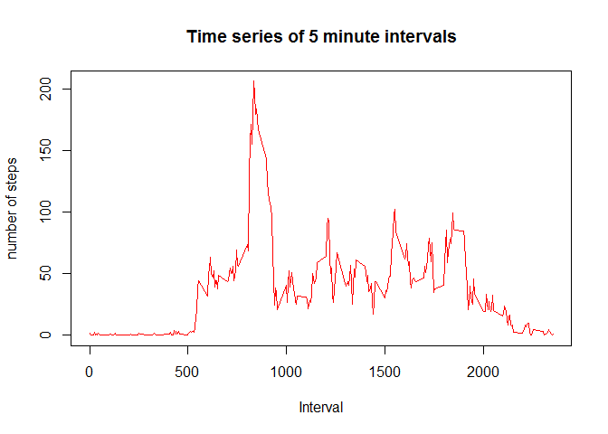
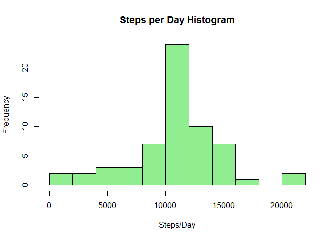

**Monitoring Personal Activity**
============================
###*Tej Patel*
###*June 22, 2016*

##Introduction
It is now possible to collect a large amount of data about personal movement using activity monitoring devices such as a Fitbit, Nike Fuelband, or Jawbone Up. These type of devices are part of the "quantified self" movement - a group of enthusiasts who take measurements about themselves regularly to improve their health, to find patterns in their behavior, or because they are tech geeks. But these data remain under-utilized both because the raw data are hard to obtain and there is a lack of statistical methods and software for processing and interpreting the data.

This report makes use of data from a personal activity monitoring device. This device collects data at 5 minute intervals through out the day. The data consists of two months of data from an anonymous individual collected during the months of October and November, 2012 and include the number of steps taken in 5 minute intervals each day.

##Data Loading and Preprocessing

```r
activityData <- read.csv("activity.csv", header = TRUE, sep = ",", na.string = "NA")
options(scipen = 1, digits = 2) ##Formats output of numbers in Knit
```

Checking header names for data:

```r
head(activityData)
```

```
##   steps       date interval
## 1    NA 2012-10-01        0
## 2    NA 2012-10-01        5
## 3    NA 2012-10-01       10
## 4    NA 2012-10-01       15
## 5    NA 2012-10-01       20
## 6    NA 2012-10-01       25
```

##Total Number of Steps per Day

Total number of steps per day calculated below:

```r
sumCalc <- tapply(activityData$steps, activityData$date, sum, na.rm = TRUE)
```

Using this, a histogram of total number of steps taken each day was created:

```r
hist(sumCalc, breaks = 10, col = "lightgreen", main = "Steps per Day Histogram", xlab = "Steps/Day")
```

<!-- -->

Calculations for mean/median number of steps a day:

```r
meanSteps <- round(mean(sumCalc))
medSteps <- median(sumCalc)
```

The mean number of steps per day is 9354.

The median number of steps per day is 10395.

##Average Daily Activity Pattern

```r
intCalc <- tapply(activityData$steps, activityData$interval, mean, na.rm = TRUE)
plot(intCalc ~ unique(activityData$interval), type = "l", xlab = "Interval", main = "Time series of 5 minute intervals", ylab = "number of steps", col = "red")
```

<!-- -->

Calculations for maximum interval:

```r
maxSteps <- round(intCalc[which.max(intCalc)], digits = 1)
maxInt <- activityData$interval[which.max(intCalc)]
```
On an average day, the max number of steps in a given interval occured in the time interval #835 with 206.2 steps.

##Inputing Missing values

```r
missSum <- nrow(activityData) - sum(complete.cases(activityData)) 
```
The total number of missing values is 2304.

The strategy used for filling missing numbers will be to take the average number of steps for that given interval and replace the missing value with said average.

```r
newData <- activityData
for (i in 1:nrow(activityData)){
    if(!complete.cases(activityData)[i]){
        if(i%%nrow(intCalc) == 0){
            newData[i,1] <- intCalc[288]
        }
        else{
            newData[i,1] <- intCalc[i%%nrow(intCalc)]
        }
    }
}
```

A histogram using the new data is below:

```r
sumCalc2 <- tapply(newData$steps, newData$date, sum, na.rm = TRUE)
hist(sumCalc2, breaks = 10, col = "lightgreen", main = "Steps per Day Histogram", xlab = "Steps/Day")
```

<!-- -->
Calculations for mean/median number of steps a day:

```r
meanSteps2 <- round(mean(sumCalc2))
medSteps2 <- round(median(sumCalc2))
```

The mean number of steps per day is 10766.

The median number of steps per day is 10766.

The new mean of 10766 is much larger than the previous 9354 while the new median 10766 is larger, but by a much smaller factor than 10395.

##Weekday and Weekend Differences

```r
newData$weekday <- c("weekday")
newData[weekdays(as.Date(newData[, 2])) %in% c("Saturday", "Sunday"), ][4] <- c("weekend")
newData$weekday <- factor(newData$weekday)
newData_weekend <- subset(newData, newData$weekday == "weekend")
newData_weekday <- subset(newData, newData$weekday == "weekday")
mean_newData_weekday <- tapply(newData_weekday$steps, newData_weekday$interval, mean)
mean_newData_weekend <- tapply(newData_weekend$steps, newData_weekend$interval, mean)
```

Plot of weekend vs weekdays:

```r
library(lattice)
df_weekday <- data.frame(interval = unique(newData_weekday$interval), avg = as.numeric(mean_newData_weekday), day = rep("weekday", length(mean_newData_weekday)))
df_weekend <- data.frame(interval = unique(newData_weekend$interval), avg = as.numeric(mean_newData_weekend), day = rep("weekend", length(mean_newData_weekend)))
df_final <- rbind(df_weekday, df_weekend)
xyplot(avg ~ interval | day, data = df_final, layout = c(1, 2), type = "l", ylab = "Number of Steps")
```

<!-- -->

The following can be noticed on differences between weekends and weekdays for this individual:

* Individual wakes up earlier, or is at least more active on weekdays.
* Individual does more activity on weekends during the day.
